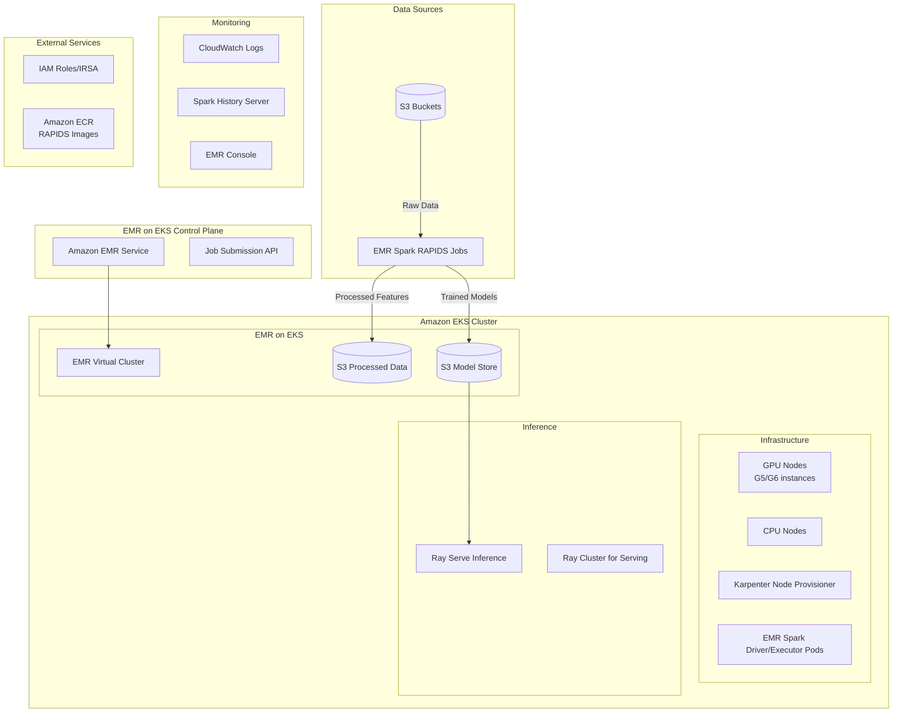

# Design Document

## Overview

This design document outlines the architecture for running the NVIDIA RAPIDS-accelerated fraud detection system using EMR on EKS instead of standalone EMR clusters. The solution leverages Amazon EMR on EKS to run Spark RAPIDS workloads on Kubernetes infrastructure, maintaining the same performance characteristics while providing the operational benefits of Kubernetes orchestration and cost optimization.

## Architecture

### High-Level Architecture



### Component Architecture

#### 1. EKS Cluster Configuration (via data-on-eks Blueprint)
- **Blueprint Foundation**: Use data-on-eks blueprint as the base infrastructure
- **EMR on EKS Module**: Leverage blueprint's EMR on EKS module with customizations for GPU workloads
- **Karpenter NodePools**: Pre-configured for data workloads with GPU instance support
  - GPU instances: g5.4xlarge, g6.4xlarge with NVIDIA A10G/A40 GPUs
  - CPU instances: r5.xlarge to r5.4xlarge for driver pods and system components
  - Spot instances with intelligent provisioning
- **NVIDIA GPU Operator**: Automatically installed via blueprint add-ons

#### 2. EMR on EKS Data Processing
- **Spark RAPIDS**: Same configuration as existing EMR cluster with GPU acceleration
- **Job Submission**: EMR StartJobRun API or AWS CLI for job submission
- **Container Images**: EMR-provided images with RAPIDS support or custom images in ECR
- **Data Flow**: S3 → EMR Spark Jobs on EKS → S3 (processed features)

#### 3. ML Training System
- **XGBoost on Spark**: Distributed training using Spark MLlib with GPU acceleration
- **EMR Job Pattern**: Submit training jobs via EMR on EKS virtual cluster
- **Model Storage**: Same S3 model storage pattern as existing implementation
- **Resource Management**: Kubernetes-native resource allocation for Spark executors

#### 4. Inference with Ray Serve
- **Ray Serve**: Scalable model serving with automatic load balancing and batching
- **Ray Cluster on EKS**: Dedicated Ray cluster for serving workloads
- **Model Loading**: Load XGBoost models from S3 with Ray Serve model management
- **Auto-scaling**: Ray Serve handles replica scaling based on request load

## Components and Interfaces

### Infrastructure Provisioning with data-on-eks Blueprint
- **Blueprint Base**: Use AWS data-on-eks blueprint as foundation for proven data workload patterns
- **Terraform Modules**: Leverage blueprint's pre-built modules for EMR on EKS, Karpenter, and GPU support
- **Customization**: Extend blueprint with fraud detection specific configurations
- **Best Practices**: Inherit security, networking, and operational best practices from the blueprint

**Recommended Blueprint: EMR EKS with Karpenter**

The `emr-eks-karpenter` blueprint is the best fit because:
- **EMR on EKS Support**: Pre-configured for running EMR workloads on Kubernetes
- **Karpenter Integration**: Optimized node provisioning for Spark workloads
- **GPU Support**: Can be extended to support GPU instances for RAPIDS
- **Cost Optimization**: Karpenter provides intelligent spot instance management
- **Spark Optimized**: Tuned for Spark driver/executor pod patterns

**Example Terraform Configuration:**
```hcl
# main.tf - Using EMR EKS Karpenter Blueprint
module "emr_eks_karpenter" {
  source = "github.com/awslabs/data-on-eks//analytics/terraform/emr-eks-karpenter"
  
  name               = "fraud-detection-emr-eks"
  region             = var.region
  eks_cluster_version = "1.28"
  
  # VPC Configuration
  vpc_cidr = "10.1.0.0/16"
  
  # Karpenter NodePool for GPU instances
  karpenter_node_instance_family = ["g5", "g6", "r5"]
  karpenter_node_instance_types  = ["g5.4xlarge", "g6.4xlarge", "r5.xlarge", "r5.2xlarge"]
  
  # EMR on EKS Teams
  emr_on_eks_teams = {
    fraud-detection-team = {
      namespace                = "emr-fraud-detection"
      job_execution_role      = "EMRContainers-JobExecutionRole-FraudDetection"
      additional_iam_policies = [
        # S3 access for fraud detection data
        "arn:aws:iam::aws:policy/AmazonS3ReadOnlyAccess"
      ]
    }
  }
  
  # Essential Add-ons for Fraud Detection Demo
  enable_karpenter                    = true  # Required for dynamic node provisioning
  enable_nvidia_gpu_operator          = true  # Required for GPU support with RAPIDS
  enable_aws_load_balancer_controller = true  # Required for Ray Serve LoadBalancer
  enable_metrics_server              = true  # Required for HPA and resource monitoring
  
  # Optional Add-ons (can be disabled for demo)
  enable_cluster_autoscaler          = false # Using Karpenter instead
  enable_prometheus                  = false # Can be added later if monitoring needed
  enable_grafana                     = false # Can be added later if monitoring needed
  enable_aws_efs_csi_driver         = false # Not needed for S3-based data
  enable_aws_fsx_csi_driver         = false # Not needed for this use case
  enable_velero                      = false # Not needed for demo
  enable_external_dns                = false # Not needed for demo
  enable_cert_manager                = false # Not needed for demo
  enable_ingress_nginx               = false # Using ALB instead
  
  tags = {
    Blueprint  = "emr-eks-karpenter"
    UseCase    = "fraud-detection-rapids"
    Team       = "data-science"
  }
}
```

**Add-on Selection Rationale:**

**Essential for Demo:**
- **Karpenter**: Dynamic node provisioning for EMR jobs and Ray clusters
- **NVIDIA GPU Operator**: GPU support for RAPIDS acceleration
- **AWS Load Balancer Controller**: Expose Ray Serve inference endpoints
- **Metrics Server**: Basic resource monitoring and HPA support

**Disabled for Simplicity:**
- **Prometheus/Grafana**: Can be added post-demo for production monitoring
- **EFS/FSX CSI**: Not needed since we use S3 for data storage
- **Velero**: Backup not required for demo environment
- **External DNS/Cert Manager**: Not needed for internal demo
- **Ingress NGINX**: Using ALB for simpler setup

**Alternative Consideration:**
If Ray workloads become primary, the `ray-data-on-eks` blueprint could be considered, but since we're using EMR on EKS for the main data processing, the EMR-focused blueprint is the better choice.

### Unified Notebook Experience with JupyterHub on EKS

**JupyterHub as Single Interface for All Workloads**

JupyterHub on EKS provides a unified Jupyter notebook experience that can seamlessly connect to both EMR on EKS and Ray clusters, giving data scientists a single platform for all phases of the fraud detection pipeline:

**1. Data Analytics & Feature Engineering**
```python
# Notebook: 01_fraud_detection_feature_engineering.ipynb
# Same code as existing notebook, runs on EMR on EKS with RAPIDS

from pyspark.sql import SparkSession
from pyspark.sql import functions as F

# EMR Studio automatically configures Spark session with EKS
spark = SparkSession.builder \
    .appName("Fraud Detection Feature Engineering") \
    .config("spark.rapids.sql.enabled", "true") \
    .config("spark.plugins", "com.nvidia.spark.SQLPlugin") \
    .getOrCreate()

# Same feature engineering code from existing notebook
customers_df = spark.read.parquet("s3://fraud-data/customers/")
# ... rest of existing notebook code
```

**2. Model Training**
```python
# Notebook: 02_fraud_detection_training.ipynb
# XGBoost training using Spark MLlib on EMR on EKS

from pyspark.ml.classification import GBTClassifier
from pyspark.ml.evaluation import BinaryClassificationEvaluator

# Load processed features from previous notebook
features_df = spark.read.parquet("s3://fraud-data/processed/")

# Train XGBoost model with GPU acceleration
gbt = GBTClassifier(featuresCol="features", labelCol="TX_FRAUD_1")
model = gbt.fit(features_df)

# Save model to S3
model.write().overwrite().save("s3://fraud-models/xgboost-model/")
```

**3. Inference & Batch Scoring**
```python
# Notebook: 03_fraud_detection_inference.ipynb
# Batch inference using the trained model

from pyspark.ml.classification import GBTClassificationModel

# Load trained model
model = GBTClassificationModel.load("s3://fraud-models/xgboost-model/")

# Load new transaction data
new_transactions = spark.read.parquet("s3://fraud-data/new-transactions/")

# Apply same feature engineering pipeline
processed_features = apply_feature_engineering(new_transactions)

# Generate predictions
predictions = model.transform(processed_features)
predictions.write.mode("overwrite").parquet("s3://fraud-predictions/batch-results/")
```

**JupyterHub Configuration for Unified Experience:**

```yaml
# jupyterhub-values.yaml
hub:
  config:
    JupyterHub:
      authenticator_class: 'oauthenticator.generic.GenericOAuthenticator'
    GenericOAuthenticator:
      client_id: 'your-oauth-client-id'
      oauth_callback_url: 'https://jupyterhub.example.com/hub/oauth_callback'
    
    Spawner:
      default_url: '/lab'
      
  extraEnv:
    VIRTUAL_CLUSTER_ID: 'emr-virtual-cluster-id'
    RAY_CLUSTER_ADDRESS: 'ray://ray-cluster-head:10001'

singleuser:
  profileList:
    - display_name: "Fraud Detection - Data Processing"
      description: "EMR Spark + RAPIDS for feature engineering"
      default: true
      kubespawner_override:
        image: 'fraud-detection/spark-rapids-notebook:latest'
        cpu_limit: 2
        mem_limit: '8G'
        environment:
          SPARK_DRIVER_MEMORY: '4g'
          VIRTUAL_CLUSTER_ID: 'emr-virtual-cluster-id'
          
    - display_name: "Fraud Detection - ML Training"
      description: "Ray + XGBoost for distributed training"
      kubespawner_override:
        image: 'fraud-detection/ray-ml-notebook:latest'
        cpu_limit: 4
        mem_limit: '16G'
        environment:
          RAY_ADDRESS: 'ray://ray-cluster-head:10001'
          
    - display_name: "Fraud Detection - Unified"
      description: "Both Spark and Ray capabilities"
      kubespawner_override:
        image: 'fraud-detection/unified-notebook:latest'
        cpu_limit: 4
        mem_limit: '16G'
        environment:
          VIRTUAL_CLUSTER_ID: 'emr-virtual-cluster-id'
          RAY_ADDRESS: 'ray://ray-cluster-head:10001'

  storage:
    type: 'static'
    static:
      pvcName: 'jupyterhub-shared-storage'
      subPath: '{username}'
    capacity: '10Gi'
    
  serviceAccountName: 'jupyterhub-user-sa'

# Service account with IRSA for S3 access
rbac:
  create: true
  
serviceAccount:
  create: true
  annotations:
    eks.amazonaws.com/role-arn: 'arn:aws:iam::ACCOUNT:role/JupyterHub-S3-Access-Role'
```

**Notebook Integration Examples:**

**1. EMR on EKS Integration (from JupyterHub notebook):**
```python
# fraud_detection_spark.ipynb
from pyspark.sql import SparkSession
import os

# Connect to EMR on EKS cluster
spark = SparkSession.builder \
    .appName("Fraud Detection Feature Engineering") \
    .config("spark.kubernetes.container.image", "fraud-detection/spark-rapids:latest") \
    .config("spark.kubernetes.namespace", "emr-fraud-detection") \
    .config("spark.rapids.sql.enabled", "true") \
    .config("spark.plugins", "com.nvidia.spark.SQLPlugin") \
    .getOrCreate()

# Same notebook code as existing EMR implementation
customers_df = spark.read.parquet("s3://fraud-data/customers/")
# ... existing feature engineering code
```

**2. Ray Cluster Integration (from same JupyterHub):**
```python
# fraud_detection_ray.ipynb
import ray
from ray.train.xgboost import XGBoostTrainer

# Connect to Ray cluster
ray.init(address=os.environ.get('RAY_ADDRESS'))

# Distributed XGBoost training
trainer = XGBoostTrainer(
    scaling_config=ray.train.ScalingConfig(num_workers=4, use_gpu=True),
    datasets={"train": train_dataset, "valid": test_dataset},
    params={"tree_method": "gpu_hist", "objective": "binary:logistic"}
)

result = trainer.fit()
```

**3. Unified Workflow (single notebook):**
```python
# fraud_detection_unified.ipynb
# Data processing with Spark RAPIDS
spark_result = process_with_spark_rapids(raw_data)

# Training with Ray
ray_model = train_with_ray_xgboost(spark_result)

# Serving with Ray Serve
deploy_ray_serve_model(ray_model)
```

**JupyterHub Deployment via Helm:**
```bash
# Install JupyterHub with custom configuration
helm repo add jupyterhub https://hub.jupyter.org/helm-chart/
helm repo update

helm install jupyterhub jupyterhub/jupyterhub \
  --namespace jupyterhub \
  --create-namespace \
  --values jupyterhub-values.yaml \
  --version 3.2.1
```

### Library and Configuration Migration from EMR/SageMaker to EKS

**EMR on EC2 → EMR on EKS Changes:**

**Spark Session Configuration:**
```python
# OLD: EMR on EC2 (from existing notebook)
spark = SparkSession.builder \
    .appName("Fraud Detection Feature Engineering") \
    .config("spark.executor.memory", "80G") \
    .config("spark.sql.shuffle.partitions", "20000") \
    .getOrCreate()

# NEW: EMR on EKS (updated for Kubernetes)
spark = SparkSession.builder \
    .appName("Fraud Detection Feature Engineering") \
    .config("spark.kubernetes.container.image", "fraud-detection/spark-rapids:latest") \
    .config("spark.kubernetes.namespace", "emr-fraud-detection") \
    .config("spark.kubernetes.executor.podNamePrefix", "fraud-detection") \
    .config("spark.executor.memory", "30G")  # Adjusted for container limits \
    .config("spark.sql.shuffle.partitions", "20000") \
    .config("spark.rapids.sql.enabled", "true") \
    .config("spark.plugins", "com.nvidia.spark.SQLPlugin") \
    .getOrCreate()
```

**SageMaker → Ray on EKS Changes:**

**Training Job Submission:**
```python
# OLD: SageMaker (from xgb_training_job.ipynb)
from sagemaker.pytorch import PyTorch

gpu_job = PyTorch(
    source_dir="src",
    entry_point="train.py",
    framework_version="2.3",
    py_version="py311",
    role=role,
    instance_type="ml.g5.12xlarge",
    instance_count=1
)
gpu_job.fit()

# NEW: Ray on EKS
import ray
from ray.train.xgboost import XGBoostTrainer

ray.init(address="ray://ray-cluster-head:10001")

trainer = XGBoostTrainer(
    scaling_config=ray.train.ScalingConfig(
        num_workers=4, 
        use_gpu=True,
        resources_per_worker={"GPU": 1, "CPU": 8}
    ),
    datasets={"train": train_data, "valid": test_data},
    params={
        "tree_method": "gpu_hist",
        "objective": "binary:logistic",
        "eval_metric": ["logloss", "error"]
    },
    num_boost_round=100
)

result = trainer.fit()
```

**Library Dependencies Changes:**

**Container Image Requirements:**
```dockerfile
# fraud-detection/unified-notebook:latest
FROM rayproject/ray:2.8.0-py310

# Install Spark and RAPIDS dependencies
RUN pip install pyspark==3.5.0 \
    cudf-cu11 \
    cuml-cu11 \
    cugraph-cu11 \
    xgboost[gpu] \
    boto3 \
    s3fs

# Install EMR on EKS specific libraries
RUN pip install kubernetes \
    pyspark-stubs

# Copy existing notebook code (adapted)
COPY notebooks/ /home/jovyan/notebooks/
COPY src/ /home/jovyan/src/
```

**Authentication Changes:**

**S3 Access:**
```python
# OLD: SageMaker (automatic IAM role)
import boto3
s3 = boto3.client('s3')  # Uses SageMaker execution role

# NEW: EKS with IRSA
import boto3
# Uses service account with IRSA annotation
s3 = boto3.client('s3')  # Same code, different auth mechanism
```

**Model Storage/Loading:**
```python
# OLD: SageMaker model artifacts
model_path = "/opt/ml/model/model.xgb"

# NEW: S3-based model storage (same as existing inference notebook)
import boto3
import tarfile

def load_model_from_s3(bucket_name, s3_file_path):
    s3 = boto3.client('s3')
    s3.download_file(bucket_name, s3_file_path, '/tmp/model.tar.gz')
    # ... same extraction logic as existing inference.ipynb
```

**Configuration Management:**

**Environment Variables:**
```python
# Unified configuration for both Spark and Ray
import os

# EMR on EKS configuration
VIRTUAL_CLUSTER_ID = os.environ.get('VIRTUAL_CLUSTER_ID')
EMR_EXECUTION_ROLE = os.environ.get('EMR_EXECUTION_ROLE_ARN')

# Ray configuration  
RAY_ADDRESS = os.environ.get('RAY_ADDRESS', 'ray://ray-cluster-head:10001')

# S3 paths (same as existing)
CUSTOMERS_PATH = "s3://nvidia-aws-fraud-detection-demo-training-data/customers_parquet/"
TRANSACTIONS_PATH = "s3://nvidia-aws-fraud-detection-demo-training-data/transactions_parquet/"
```

**Key Migration Points:**
- **No SageMaker SDK**: Replace with Ray Train API
- **Kubernetes-aware Spark**: Add Kubernetes-specific Spark configurations
- **Container Images**: Package dependencies in custom images
- **IRSA Authentication**: Replace SageMaker roles with Kubernetes service accounts
- **Resource Limits**: Adjust memory/CPU settings for container environments
- **Same Business Logic**: Core feature engineering and model code remains unchanged

**Benefits of JupyterHub on EKS Approach:**
- **True Unified Experience**: Single notebook interface for all workloads
- **Flexible Compute**: Choose Spark or Ray backend per notebook or cell
- **Native Kubernetes**: Leverages EKS for scaling and resource management
- **Cost Effective**: Notebooks only consume resources when active
- **Collaboration**: Shared workspace with version control integration
- **Extensible**: Easy to add new compute backends or notebook environments

### Application Deployment
- **Kubernetes Deployments**: All Kubernetes resources deployed via manifests or Helm charts
- **Separation of Concerns**: Clear boundary between infrastructure (Terraform) and application deployment (Kubernetes/Helm)

### EMR on EKS Job Configuration

**EMR Virtual Cluster Setup:**
```json
{
  "name": "fraud-detection-cluster",
  "containerProvider": {
    "type": "EKS",
    "id": "fraud-detection-eks",
    "info": {
      "eksInfo": {
        "namespace": "emr-fraud-detection"
      }
    }
  }
}
```

**Spark Job Configuration:**
```json
{
  "name": "fraud-feature-engineering",
  "virtualClusterId": "virtual-cluster-id",
  "executionRoleArn": "arn:aws:iam::account:role/EMRContainers-JobExecutionRole",
  "releaseLabel": "emr-6.15.0-latest",
  "jobDriver": {
    "sparkSubmitJobDriver": {
      "entryPoint": "s3://fraud-detection-code/feature_engineering.py",
      "sparkSubmitParameters": "--conf spark.rapids.sql.enabled=true --conf spark.plugins=com.nvidia.spark.SQLPlugin"
    }
  },
  "configurationOverrides": {
    "applicationConfiguration": [
      {
        "classification": "spark-defaults",
        "properties": {
          "spark.executor.instances": "12",
          "spark.executor.memory": "30G",
          "spark.executor.resource.gpu.amount": "1",
          "spark.rapids.sql.enabled": "true"
        }
      }
    ]
  }
}
```

**Karpenter NodePool (Kubernetes Manifest):**
```yaml
# File: k8s-manifests/karpenter-nodepool.yaml
apiVersion: karpenter.sh/v1beta1
kind: NodePool
metadata:
  name: emr-gpu-nodepool
spec:
  template:
    metadata:
      labels:
        workload-type: emr-gpu
    spec:
      requirements:
        - key: kubernetes.io/arch
          operator: In
          values: ["amd64"]
        - key: node.kubernetes.io/instance-type
          operator: In
          values: ["g5.4xlarge", "g6.4xlarge"]
        - key: karpenter.sh/capacity-type
          operator: In
          values: ["spot", "on-demand"]
      nodeClassRef:
        apiVersion: karpenter.k8s.aws/v1beta1
        kind: EC2NodeClass
        name: emr-gpu-nodeclass
      taints:
        - key: nvidia.com/gpu
          value: "true"
          effect: NoSchedule
  limits:
    cpu: 1000
    memory: 1000Gi
  disruption:
    consolidationPolicy: WhenEmpty
    consolidateAfter: 30s
```

**Key Interfaces:**
- Input: S3 paths for customer, terminal, transaction data (same as existing)
- Output: Processed Parquet files with engineered features (same format)
- Configuration: Spark configurations via EMR job parameters

### ML Training Component

**EMR Training Job Configuration:**
```json
{
  "name": "fraud-xgboost-training",
  "virtualClusterId": "virtual-cluster-id",
  "executionRoleArn": "arn:aws:iam::account:role/EMRContainers-JobExecutionRole",
  "releaseLabel": "emr-6.15.0-latest",
  "jobDriver": {
    "sparkSubmitJobDriver": {
      "entryPoint": "s3://fraud-detection-code/xgboost_training.py",
      "sparkSubmitParameters": "--conf spark.rapids.sql.enabled=true --conf spark.plugins=com.nvidia.spark.SQLPlugin"
    }
  },
  "configurationOverrides": {
    "applicationConfiguration": [
      {
        "classification": "spark-defaults",
        "properties": {
          "spark.executor.instances": "4",
          "spark.executor.memory": "30G",
          "spark.executor.resource.gpu.amount": "1",
          "spark.rapids.sql.enabled": "true",
          "spark.sql.execution.arrow.pyspark.enabled": "true"
        }
      }
    ]
  }
}
```

### Ray Serve Inference Component

**Ray Cluster via Helm Chart:**
```yaml
# File: helm-values/ray-cluster-values.yaml
# Using KubeRay Helm chart (latest version)
image:
  repository: rayproject/ray
  tag: "2.8.0-py310"

head:
  rayStartParams:
    dashboard-host: '0.0.0.0'
  resources:
    limits:
      cpu: 2
      memory: 8Gi
    requests:
      cpu: 1
      memory: 4Gi

worker:
  replicas: 2
  minReplicas: 1
  maxReplicas: 5
  groupName: inference-workers
  resources:
    limits:
      cpu: 4
      memory: 16Gi
    requests:
      cpu: 2
      memory: 8Gi

service:
  type: LoadBalancer
  port: 8000
```

**Helm Installation Command:**
```bash
helm repo add kuberay https://ray-project.github.io/kuberay-helm/
helm repo update
helm install ray-cluster kuberay/ray-cluster -f helm-values/ray-cluster-values.yaml
```

**Ray Serve Application:**
```python
from ray import serve
import xgboost as xgb
import pandas as pd
import boto3

@serve.deployment(num_replicas=2, ray_actor_options={"num_cpus": 2})
class FraudDetectionModel:
    def __init__(self):
        # Load model from S3 (same pattern as existing notebook)
        self.model = self.load_model_from_s3()
    
    def load_model_from_s3(self):
        # Use same model loading logic from inference.ipynb
        s3 = boto3.client('s3')
        # ... model loading code
        return xgb.Booster(model_file=model_path)
    
    async def __call__(self, request):
        # Use same preprocessing from existing notebook
        features = self.preprocess_data(request)
        prediction = self.model.predict(features)
        return {"fraud_probability": float(prediction[0])}

app = FraudDetectionModel.bind()
```

**EMR on EKS Namespace Setup (Kubernetes Manifest):**
```yaml
# File: k8s-manifests/emr-namespace.yaml
apiVersion: v1
kind: Namespace
metadata:
  name: emr-fraud-detection
  labels:
    name: emr-fraud-detection
---
apiVersion: v1
kind: ServiceAccount
metadata:
  name: emr-containers-sa-spark
  namespace: emr-fraud-detection
  annotations:
    eks.amazonaws.com/role-arn: arn:aws:iam::ACCOUNT:role/EMRContainers-JobExecutionRole
---
apiVersion: rbac.authorization.k8s.io/v1
kind: Role
metadata:
  namespace: emr-fraud-detection
  name: emr-containers
rules:
- apiGroups: [""]
  resources: ["pods"]
  verbs: ["get", "list", "watch", "describe", "create", "edit", "delete", "deletecollection"]
- apiGroups: [""]
  resources: ["configmaps"]
  verbs: ["get", "list", "watch", "describe", "create", "edit", "delete", "deletecollection"]
---
apiVersion: rbac.authorization.k8s.io/v1
kind: RoleBinding
metadata:
  name: emr-containers
  namespace: emr-fraud-detection
subjects:
- kind: ServiceAccount
  name: emr-containers-sa-spark
  namespace: emr-fraud-detection
roleRef:
  kind: Role
  name: emr-containers
  apiGroup: rbac.authorization.k8s.io
```

## Data Models

### Input Data Schema
```python
# Customer Data
customer_schema = {
    "CUSTOMER_ID": "string",
    "customer_name": "string",
    "billing_city": "string",
    "billing_state": "string",
    "x_customer_id": "double",
    "y_customer_id": "double",
    "mean_amount": "double",
    "std_amount": "double"
}

# Transaction Data
transaction_schema = {
    "TX_DATETIME": "timestamp",
    "CUSTOMER_ID": "string",
    "TERMINAL_ID": "string",
    "TX_AMOUNT": "double",
    "TX_FRAUD": "integer"
}
```

### Processed Feature Schema
```python
processed_features = {
    "CUSTOMER_ID_index": "double",
    "TERMINAL_ID_index": "double",
    "TX_AMOUNT": "double",
    "yyyy": "integer",
    "mm": "integer", 
    "dd": "integer",
    # Time-window features
    "customer_id_nb_txns_15min_window": "long",
    "customer_id_avg_amt_15min_window": "double",
    # ... (31 total features as per current implementation)
    "TX_FRAUD_1": "integer"  # Target variable
}
```

### API Request/Response Models
```python
# Inference Request
class FraudPredictionRequest(BaseModel):
    customer_id: str
    terminal_id: str
    tx_amount: float
    tx_datetime: datetime
    # Additional features...

# Inference Response  
class FraudPredictionResponse(BaseModel):
    transaction_id: str
    fraud_probability: float
    fraud_prediction: bool
    confidence_score: float
    processing_time_ms: int
```

## Error Handling

### Job Failure Recovery
- **Retry Logic**: Exponential backoff with maximum retry attempts
- **Dead Letter Queue**: Failed jobs moved to separate namespace for analysis
- **Alerting**: Integration with AWS SNS/CloudWatch for failure notifications

### Resource Exhaustion
- **Queue Management**: Priority-based job scheduling with resource quotas
- **Graceful Degradation**: Fallback to CPU processing when GPU resources unavailable
- **Circuit Breaker**: Automatic service protection during high error rates

### Data Quality Issues
- **Validation**: Schema validation at ingestion with detailed error reporting
- **Monitoring**: Data drift detection and alerting
- **Fallback**: Default model behavior for missing or invalid features

## Testing Strategy

### Unit Testing
- **Component Tests**: Individual container testing with mock data
- **Integration Tests**: End-to-end pipeline testing with sample datasets
- **Performance Tests**: Benchmarking against EMR/SageMaker baseline

### Load Testing
- **Inference API**: Concurrent request handling and latency testing
- **Batch Processing**: Large dataset processing validation
- **Auto-scaling**: Resource scaling behavior under load

### Disaster Recovery Testing
- **Node Failure**: Pod rescheduling and data consistency validation
- **Zone Failure**: Multi-AZ deployment resilience testing
- **Data Recovery**: S3 backup and restore procedures

### Security Testing
- **Network Policies**: Traffic isolation validation
- **RBAC**: Role-based access control verification
- **Secrets Management**: Credential rotation and access auditing

## Deployment Architecture

### Infrastructure Layer (Terraform with data-on-eks Blueprint)
- **data-on-eks Blueprint**: Leverage proven patterns from AWS data-on-eks blueprint
- **EMR on EKS Module**: Use blueprint's EMR on EKS module with GPU support
- **Karpenter Configuration**: Pre-configured Karpenter setup optimized for data workloads
- **Networking & Security**: VPC, subnets, and security groups following data workload best practices
- **Add-ons**: Essential add-ons like AWS Load Balancer Controller, EBS CSI driver, etc.

### Application Layer (Kubernetes/Helm)
- **Karpenter NodePools**: Deployed via Kubernetes manifests
- **EMR Namespace Setup**: RBAC and service accounts via Kubernetes manifests
- **Ray Cluster**: Deployed via official KubeRay Helm chart (latest version)
- **Monitoring Stack**: Prometheus/Grafana via community Helm charts

### Job Submission
- **EMR Jobs**: Submitted via AWS CLI or SDK (not managed by Kubernetes)
- **Ray Serve**: Applications deployed via Ray CLI or Python scripts
- **Configuration**: Environment-specific configurations via ConfigMaps/Secrets

## Performance Considerations

### EMR on EKS Optimization
- **GPU Utilization**: Same RAPIDS configurations as standalone EMR for optimal GPU usage
- **Spark Configuration**: Leverage existing Spark tuning parameters from current notebooks
- **Node Scaling**: Karpenter handles fast node provisioning for EMR jobs with better cost optimization

### Cost Optimization
- **Spot Instances**: Karpenter supports spot instances with automatic fallback to on-demand
- **Dynamic Scaling**: Jobs scale down automatically when complete, Karpenter terminates unused nodes
- **Resource Sharing**: Multiple EMR jobs can share the same EKS cluster infrastructure
- **Intelligent Provisioning**: Karpenter selects optimal instance types based on workload requirements

### Performance Expectations
- **Same Performance**: EMR on EKS should match standalone EMR performance characteristics
- **Kubernetes Overhead**: Minimal overhead due to EMR managing Spark lifecycle
- **Startup Time**: Slightly longer job startup due to pod scheduling, but negligible for long-running jobs

## Security Architecture

### EMR on EKS Security
- **Job Execution Role**: IAM role for EMR jobs to access S3 and other AWS services
- **RBAC**: Kubernetes RBAC for EMR service account in designated namespace
- **Network Isolation**: EMR pods run in dedicated namespace with network policies

### Data Protection
- **Encryption**: Same S3 encryption and TLS as existing EMR implementation
- **IAM Integration**: Leverage existing IAM roles and policies from current setup
- **Audit Logging**: EMR job logs in CloudWatch, Kubernetes audit logs for cluster events

### Simplified Security Model
- **EMR Managed**: EMR service handles most security configurations automatically
- **Existing Patterns**: Reuse security configurations from current EMR setup
- **Kubernetes Native**: Benefit from EKS security features without additional complexity