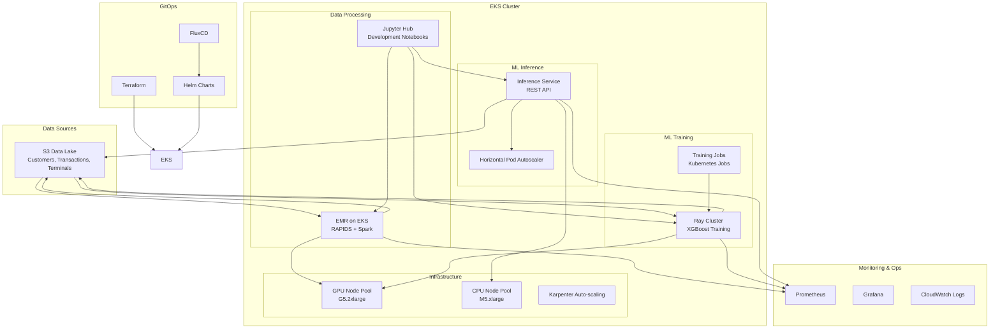

# Design Document: EMR to EKS Migration with RAPIDS and AI/ML Workloads

## Overview

This design document outlines the architecture for migrating the fraud detection analytics pipeline from traditional EMR to EMR on EKS with NVIDIA RAPIDS, and transitioning SageMaker model training and inference to EKS using AWS Data on EKS and AI on EKS blueprints. The solution leverages proven patterns and best practices from these blueprints to ensure scalability, cost efficiency, and operational excellence.

The migration consists of three main components:
1. **Data Processing**: EMR on EKS with RAPIDS for GPU-accelerated analytics
2. **Model Training**: Ray-based distributed training on EKS using AI on EKS patterns
3. **Model Inference**: Scalable inference services on EKS with auto-scaling capabilities

## Architecture

### High-Level Architecture



### Data on EKS Blueprint Integration

The existing EMR Spark RAPIDS blueprint provides the foundation with these proven components:

- **EKS Cluster**: Pre-configured with g5.2xlarge GPU nodes and m5.xlarge CPU nodes
- **EMR on EKS**: Virtual clusters for ml-team-a and ml-team-b namespaces
- **NVIDIA GPU Support**: AL2_x86_64_GPU AMI with GPU device plugin (not GPU Operator)
- **RAPIDS Integration**: Custom Docker images with RAPIDS libraries (cuDF, cuML, cuGraph)
- **Karpenter**: Auto-scaling for both CPU and GPU workloads with spot instance support
- **Monitoring**: Prometheus, Grafana, and CloudWatch integration
- **Storage**: S3 bucket for Spark input/output data with EBS CSI driver

### Ray Integration for ML Workloads

Ray will be integrated on top of the existing EKS cluster to provide:

- **Ray Operator**: Kubernetes-native Ray cluster management for distributed training
- **XGBoost Integration**: GPU-accelerated distributed XGBoost training
- **Resource Management**: Efficient GPU resource allocation using existing Karpenter node pools
- **Model Artifacts**: S3-based model storage compatible with existing patterns

## Components and Interfaces

### 1. EMR on EKS with RAPIDS

**Purpose**: GPU-accelerated data processing for fraud detection feature engineering

**Key Components**:
- EMR Virtual Cluster running on EKS
- NVIDIA RAPIDS libraries (cuDF, cuML, cuGraph)
- Spark with GPU scheduling enabled
- Custom Docker images with RAPIDS dependencies

**Configuration**:
```yaml
# EMR on EKS Configuration
apiVersion: emrcontainers.aws.com/v1beta1
kind: VirtualCluster
metadata:
  name: fraud-detection-rapids
spec:
  containerProvider:
    type: EKS
    id: data-on-eks-cluster
  sparkSubmitParameters:
    spark.executor.resource.gpu.amount: "1"
    spark.plugins: "com.nvidia.spark.SQLPlugin"
    spark.rapids.sql.enabled: "true"
    spark.executor.memory: "30G"
    spark.executor.instances: "12"
```

**Interfaces**:
- Input: S3 parquet files (customers, transactions, terminals)
- Output: Processed datasets for model training
- API: Spark Submit via EMR on EKS API
- Monitoring: CloudWatch metrics and Spark UI

### 2. Ray-based Model Training

**Purpose**: Distributed XGBoost training with GPU acceleration

**Key Components**:
- Ray Cluster with KubeRay operator
- XGBoost with GPU support
- Distributed training coordination
- Model artifact management

**Configuration**:
```yaml
# Ray Cluster for Training
apiVersion: ray.io/v1alpha1
kind: RayCluster
metadata:
  name: fraud-training-cluster
spec:
  rayVersion: '2.8.0'
  headGroupSpec:
    replicas: 1
    rayStartParams:
      dashboard-host: '0.0.0.0'
    template:
      spec:
        containers:
        - name: ray-head
          image: rayproject/ray-ml:2.8.0-gpu
          resources:
            requests:
              cpu: "2"
              memory: "8Gi"
  workerGroupSpecs:
  - replicas: 4
    minReplicas: 1
    maxReplicas: 10
    groupName: gpu-workers
    rayStartParams: {}
    template:
      spec:
        containers:
        - name: ray-worker
          image: rayproject/ray-ml:2.8.0-gpu
          resources:
            requests:
              cpu: "4"
              memory: "16Gi"
              nvidia.com/gpu: "1"
```

**Interfaces**:
- Input: Training data from S3
- Output: Model artifacts to S3
- API: Ray Job Submission API
- Monitoring: Ray Dashboard and Prometheus metrics

### 3. Model Inference Service

**Purpose**: Scalable XGBoost model serving with auto-scaling

**Key Components**:
- FastAPI-based inference service
- Model loading from S3
- Horizontal Pod Autoscaler
- Load balancer integration

**Configuration**:
```yaml
# Inference Deployment
apiVersion: apps/v1
kind: Deployment
metadata:
  name: fraud-inference
spec:
  replicas: 3
  selector:
    matchLabels:
      app: fraud-inference
  template:
    metadata:
      labels:
        app: fraud-inference
    spec:
      containers:
      - name: inference
        image: fraud-detection/inference:latest
        ports:
        - containerPort: 8000
        env:
        - name: MODEL_S3_PATH
          value: "s3://fraud-models/latest/model.xgb"
        resources:
          requests:
            cpu: "500m"
            memory: "1Gi"
          limits:
            cpu: "2"
            memory: "4Gi"
---
apiVersion: autoscaling/v2
kind: HorizontalPodAutoscaler
metadata:
  name: fraud-inference-hpa
spec:
  scaleTargetRef:
    apiVersion: apps/v1
    kind: Deployment
    name: fraud-inference
  minReplicas: 2
  maxReplicas: 20
  metrics:
  - type: Resource
    resource:
      name: cpu
      target:
        type: Utilization
        averageUtilization: 70
```

**Interfaces**:
- Input: HTTP POST requests with transaction data
- Output: JSON response with fraud probability
- API: REST API with OpenAPI specification
- Monitoring: Prometheus metrics for latency and throughput

### 4. Jupyter Hub Integration

**Purpose**: Development environment for data scientists with EKS integration

**Key Components**:
- JupyterHub deployment on EKS
- Shared storage for notebooks
- Integration with EMR on EKS and Ray clusters
- GPU-enabled notebook instances

**Configuration**:
```yaml
# JupyterHub Configuration
apiVersion: v1
kind: ConfigMap
metadata:
  name: jupyterhub-config
data:
  jupyterhub_config.py: |
    c.KubeSpawner.image = 'jupyter/datascience-notebook:latest'
    c.KubeSpawner.cpu_limit = 2
    c.KubeSpawner.mem_limit = '4G'
    c.KubeSpawner.storage_pvc_ensure = True
    c.KubeSpawner.storage_capacity = '10Gi'
    c.KubeSpawner.extra_resource_limits = {"nvidia.com/gpu": "1"}
```

## Data Models

### Input Data Schema

**Customers Data**:
```python
customers_schema = {
    "CUSTOMER_ID": "string",
    "x_customer_id": "double",
    "y_customer_id": "double",
    "mean_amount": "double",
    "std_amount": "double",
    "mean_nb_tx_per_day": "double"
}
```

**Transactions Data**:
```python
transactions_schema = {
    "TX_DATETIME": "timestamp",
    "CUSTOMER_ID": "string", 
    "TERMINAL_ID": "string",
    "TX_AMOUNT": "double",
    "TX_FRAUD_1": "integer",
    "yyyy": "integer",
    "mm": "integer", 
    "dd": "integer"
}
```

**Feature Engineering Output**:
```python
features_schema = {
    "TX_AMOUNT": "double",
    "yyyy": "integer",
    "mm": "integer",
    "dd": "integer",
    "customer_id_nb_txns_*_window": "integer",  # Multiple time windows
    "customer_id_avg_amt_*_window": "double",   # Multiple time windows
    "terminal_id_nb_txns_*_window": "integer",  # Multiple time windows
    "terminal_id_avg_amt_*_window": "double",   # Multiple time windows
    "TX_FRAUD_1": "integer"  # Target variable
}
```

### Model Artifacts

**XGBoost Model Format**:
- Binary format: `.xgb` files
- Metadata: JSON with feature names and model parameters
- Storage: S3 with versioning enabled
- Compression: gzip for efficient storage

## Error Handling

### Data Processing Errors

1. **Data Quality Issues**:
   - Schema validation before processing
   - Null value handling with configurable strategies
   - Data type conversion with error logging
   - Checkpoint and recovery mechanisms

2. **Resource Exhaustion**:
   - Memory monitoring with alerts
   - Automatic job retry with exponential backoff
   - Graceful degradation to CPU processing if GPU unavailable
   - Spot instance interruption handling

### Training Errors

1. **Distributed Training Failures**:
   - Worker node failure detection and replacement
   - Checkpoint-based training resumption
   - Hyperparameter validation before training start
   - Resource allocation timeout handling

2. **Model Quality Issues**:
   - Training metrics validation
   - Model performance thresholds
   - Automated model rollback on quality degradation
   - A/B testing for model deployment

### Inference Errors

1. **Service Availability**:
   - Health check endpoints
   - Circuit breaker pattern for downstream dependencies
   - Graceful degradation with cached predictions
   - Load balancer health monitoring

2. **Prediction Errors**:
   - Input validation with detailed error messages
   - Model loading failure recovery
   - Prediction timeout handling
   - Error rate monitoring and alerting

## Testing Strategy

### Unit Testing

**Data Processing**:
- RAPIDS function testing with sample datasets
- Spark transformation validation
- Feature engineering correctness verification
- Performance regression testing

**Model Training**:
- Ray cluster functionality testing
- XGBoost parameter validation
- Distributed training coordination testing
- Model artifact integrity verification

**Inference Service**:
- API endpoint testing
- Model loading and prediction accuracy
- Error handling and edge cases
- Performance and load testing

### Integration Testing

**End-to-End Pipeline**:
- Data ingestion to model deployment workflow
- Cross-component communication testing
- Resource scaling behavior validation
- Failure recovery testing

**Infrastructure Testing**:
- Terraform plan validation
- Kubernetes resource deployment testing
- Network connectivity and security testing
- Monitoring and alerting validation

### Performance Testing

**Benchmarking**:
- GPU vs CPU performance comparison
- Scaling behavior under load
- Cost efficiency measurement
- Latency and throughput optimization

**Load Testing**:
- Inference service capacity testing
- Training job concurrency limits
- Data processing throughput validation
- Resource utilization optimization

### Security Testing

**Access Control**:
- RBAC policy validation
- Service-to-service authentication testing
- Data encryption verification
- Audit log completeness testing

**Vulnerability Assessment**:
- Container image scanning
- Network security policy testing
- Secrets management validation
- Compliance requirement verification